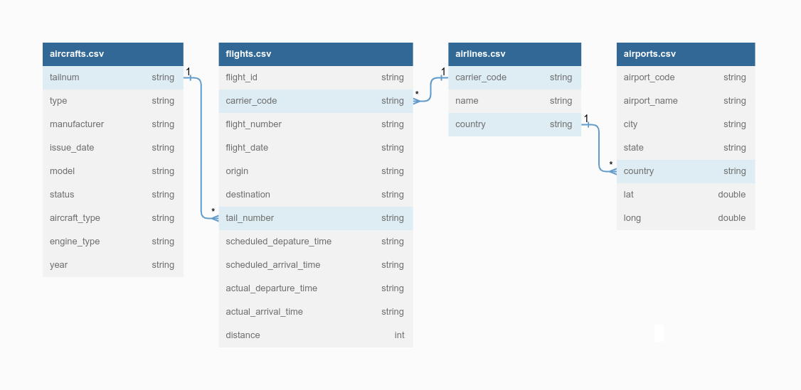

# Flights EDA

Building a data pipeline to perform EDA using PySpark DataFrame API whilst being mindful of the order in which the queries executed, and tune them in a way to optimize for performance.

AWS S3 was used to store the datasets (with the largest containing 10+ million rows) and AWS EMR to run Apache Spark and manage Spark clusters.

## Tasks

The first task was to evaluate Top 3 aircrafts where the manufacturer is "Cessna". The output should be in the form `<model> <count>`.

The second task was to calculate the average flight delay given a year.

And the third task was to evaluate the most popular aircraft types and output the top 5 for each company.

## Files

The whole analysis process can be visualized in the jupyter notebook file - `flights_analysis.ipynb`; which was initially used to experiment on the data and get a good understanding of it.

`src/main.py` contains the final source code.

## Schema

